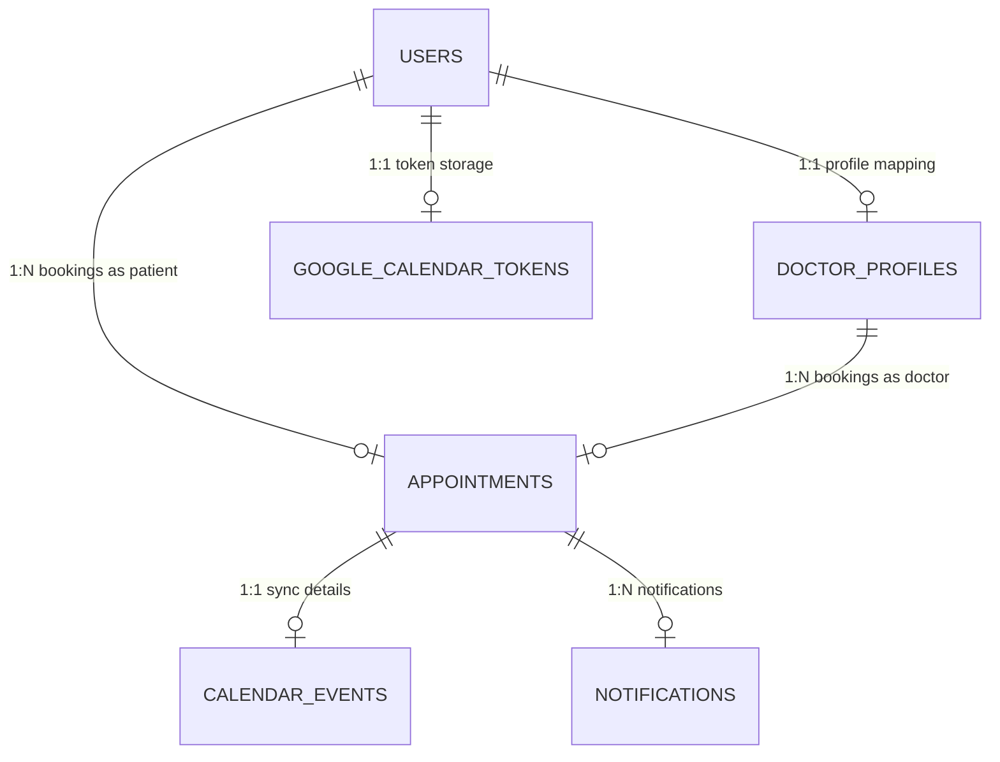

# Healthcare Appointment & Follow-up Manager

A production-grade, highly resilient healthcare booking portal featuring slot holds, role-based dashboards, automated notification retries, Google Calendar integration, and Google Gemini AI medical summarizing.

---

## 1. Project Overview
This application streamlines patient scheduling, doctor consulting, and follow-ups. Designed with high reliability constraints, it ensures concurrency control (double-booking prevention), transactional integrity, and fault-tolerance against external network services (LLM, Email, and Calendar).

## 2. Features
- **Patient Portal**: Search active doctors, select dates, view slots, request 5-minute locks (holds), submit symptoms, confirm bookings, sync schedules, and retrieve post-visit clinical summaries.
- **Doctor Portal**: Dashboard metrics, manage schedules/leaves, review symptom summaries and AI pre-visit insights, enter clinical logs, write prescriptions, and auto-parse medication schedules.
- **Admin Portal**: System activity statistics, manage doctor profiles (activation/deactivation, specializations, consulting duration), define schedules, register leaves, filter appointments, and audit notification failures.
- **Resilience Engine**: Non-blocking asynchronous calendar/email synchronization with transactional safety and cron-based retry loops.

## 3. Architecture
Decoupled client-server layout:
- **Frontend SPA**: React 19, React Router, Vite, Axios, Tailwind CSS.
- **Backend API**: Spring Boot 3.3.2, Spring Security, Hibernate JPA.
- **Datastore**: PostgreSQL 16.
- **Integrations**: SendGrid Mail, Google Cloud OAuth 2.0, Google Gemini API.

```
[React SPA] ──> [Spring Security (JWT)] ──> [Spring REST API] ──> [Hibernate JPA] ──> [PostgreSQL]
                                               │
                                               ├──> [Async: CalendarSyncService] ──> Google Calendar
                                               ├──> [Async: NotificationService] ──> SendGrid
                                               └──> [Sync: LLMService] ──> Google Gemini
```

## 4. Technology Stack
- **Java**: Version 17
- **Spring Boot**: 3.3.2 (Starter Web, Data JPA, Security, Validation)
- **Database**: PostgreSQL 16
- **Frontend**: React 19, Vite, Tailwind CSS, Axios, ES6+
- **Security**: JSON Web Token (JWT) with HMAC-SHA256 signature
- **AI**: Gemini Pro LLM API via HTTP Client
- **Email**: SendGrid API client

## 5. Folder Structure
```
Unthinkable/
├── backend/
│   ├── src/main/java/com/project/
│   │   ├── config/          # Configurations (Security, Async, Thread Pools)
│   │   ├── controller/      # REST API Controllers (RBAC Enforced)
│   │   ├── dto/             # Data Transfer Objects & Validations
│   │   ├── entity/          # JPA Domain Entities
│   │   ├── exception/       # Global RestControllerAdvice Exceptions Handler
│   │   ├── repository/      # Spring Data JPA Repositories
│   │   ├── scheduler/       # Cron schedulers (locks cleanup, email retries)
│   │   ├── security/        # JWT Authentication Filter & Providers
│   │   └── service/         # Services (Booking, Concurrency, LLM, Emails)
│   └── src/test/java/com/project/  # Unit, Concurrency, and E2E Integration Tests
├── frontend/
│   ├── src/
│   │   ├── api/             # Axios base configuration and Interceptors
│   │   ├── components/      # Common components (Protected & Role Routes)
│   │   ├── context/         # AuthContext
│   │   └── pages/           # Pages (Patient, Doctor, and Admin Dashboards)
│   ├── index.html
│   └── vite.config.js
└── docs/                    # Reference architectural & design docs
```

## 6. Database Schema
Defined in detail under [`docs/database-schema.md`](file:///C:/Users/rajga/OneDrive/Desktop/RAJ/Unthinkable/docs/database-schema.md). Consists of:
- `users`: Core login details, credentials, and roles.
- `doctor_profiles`: Experience, consultations configurations, and schedules.
- `appointments`: Booking statuses (`HELD`, `CONFIRMED`, `CANCELLED`, `COMPLETED`, `NO_SHOW`).
- `medication_schedules`: Extracted dosage instructions.
- `notifications`: Dispatch logs, retries, and errors.
- `google_calendar_tokens`: Encrypted OAuth tokens.
- `calendar_events`: Synchronized Google Calendar link maps.

## 7. ER Diagram


## 8. API Documentation
All endpoints, including payloads, responses, and parameters, are documented in [`docs/api-documentation.md`](file:///C:/Users/rajga/OneDrive/Desktop/RAJ/Unthinkable/docs/api-documentation.md).

## 9. Authentication
- Enforced on all private endpoints using JSON Web Tokens (JWT).
- Authenticated users submit standard tokens in the header: `Authorization: Bearer <token>`.
- Client Axios interceptors dynamically read and append tokens, intercepting `401 Unauthorized` states to force logout.

## 10. LLM Integration
Orchestration details, prompt schemas, type sanitization, and fallback options are listed in [`docs/llm-prompts.md`](file:///C:/Users/rajga/OneDrive/Desktop/RAJ/Unthinkable/docs/llm-prompts.md). Features:
- Pre-visit symptom summaries.
- Post-visit consultation summaries and medication parsing.

## 11. Email Integration
Mailing configurations, triggered templates, retry engines, and console logging fallbacks are described in [`docs/email-setup.md`](file:///C:/Users/rajga/OneDrive/Desktop/RAJ/Unthinkable/docs/email-setup.md).

## 12. Google Calendar Integration
Schedules sync across both patient and doctor Google Calendars on confirmation, reschedule, and cancellation. Failures do not affect core transactions.

## 13. OAuth Setup
OAuth credentials, consent parameters, scopes, and token lifecycle security details are described in [`docs/google-calendar-setup.md`](file:///C:/Users/rajga/OneDrive/Desktop/RAJ/Unthinkable/docs/google-calendar-setup.md).

## 14. Environment Variables
Check the reference file [`.env.example`](file:///C:/Users/rajga/OneDrive/Desktop/RAJ/Unthinkable/.env.example) for mandatory configurations. Key variables include:
- `SPRING_PROFILES_ACTIVE`: active profile (`dev`, `prod`, `test`).
- `JWT_SECRET`: JWT signature key.
- `LLM_PROVIDER`: `mock` or `gemini`.
- `EMAIL_ENABLED`: `true` or `false` (SendGrid toggle).

## 15. Local Setup

### Prerequisites
- Java Development Kit (JDK) 17+ installed.
- Node.js 18+ installed.
- PostgreSQL 16+ running locally.

## 16. PostgreSQL Setup
1. Create a local PostgreSQL database named `healthcare`:
   ```sql
   CREATE DATABASE healthcare;
   ```
2. Set your system user credentials inside your root `.env` file.

## 17. Frontend Setup
1. Open a terminal and navigate to `frontend/`:
   ```bash
   cd frontend
   npm install
   ```
2. Launch the Vite development server:
   ```bash
   npm run dev
   ```

## 18. Backend Setup
1. Open a terminal and navigate to `backend/`:
   ```bash
   cd backend
   ```
2. Build and run the Spring Boot application:
   ```bash
   ./mvnw spring-boot:run
   ```
   *(Wait for Hibernate to generate tables and Flyway/DataSeeder to bootstrap the default admin user)*.

## 19. Testing
1. Navigate to the `backend/` folder.
2. Compile and run all unit, concurrent, and integration tests:
   ```bash
   ./mvnw clean test
   ```

## 20. Deployment
Full instructions on deploying to Render, Supabase PostgreSQL, and Vercel are detailed in [`docs/deployment.md`](file:///C:/Users/rajga/OneDrive/Desktop/RAJ/Unthinkable/docs/deployment.md).

## 21. Known Limitations
- **Token Expiry**: Revocation of Google OAuth permissions in Google Account Settings requires the user to manually click "Disconnect" on the portal before reconnecting.
- **Mock LLM Parsing**: The Mock LLM returns standardized JSON structures which might not match exact patient custom symptoms but ensures code boundaries and tests execute successfully.

## 22. AI Safety Disclaimer
The pre-visit AI insights and post-visit patient-friendly summaries are for informational purposes only and do not constitute clinical guidance. Always consult a qualified medical professional for health issues.
