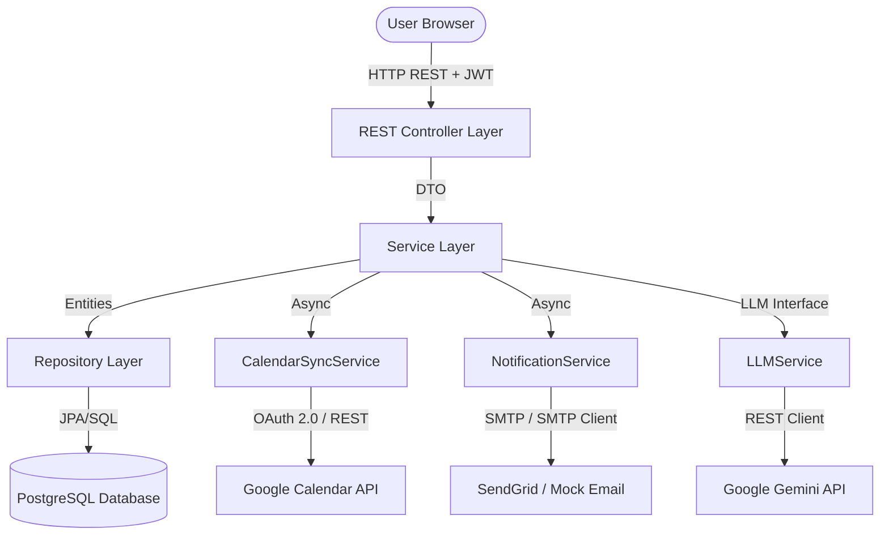

# Architecture Overview

## 1. System Topology
The Healthcare Appointment & Follow-up Manager is designed using a decoupled, client-server topology consisting of:
- **Frontend SPA**: React 19 single-page application built using Vite and Tailwind CSS.
- **Backend API**: Stateless REST API built on Spring Boot 3.3.2 and Java 17.
- **Database**: PostgreSQL 16 relational database for persistent storage.
- **External Integration Layer**: Interconnected third-party provider APIs (Google Calendar OAuth 2.0, SendGrid, and Google Gemini LLM) with strategy abstractions.

## 2. Package Structure (Backend)
The backend project layout separates concerns cleanly:
- `com.project.config`: Application, Security, Calendar, and ThreadPool configurations.
- `com.project.controller`: Endpoints enforcing RBAC authentication.
- `com.project.dto`: Request/Response structures validating parameters at boundaries.
- `com.project.entity`: JPA persistence mappings representing the database schema.
- `com.project.exception`: RestControllerAdvice handling errors globally to prevent stack leakage.
- `com.project.repository`: JPA repositories defining query boundaries.
- `com.project.scheduler`: Background schedulers (Reminders & Retry queues).
- `com.project.security`: JWT processing filters and authentication entry points.
- `com.project.service`: Business rules, transactions, and LLM orchestration.
- `com.project.service.calendar`: OAuth 2.0 integrations (Google & Mock).
- `com.project.service.email`: Mailing services (SendGrid & Mock).

## 3. Reliability & Integration Layer
To prevent third-party outages from compromising core transactions:
- **Asynchronous Execution**: Thread pools manage tasks for notifications (`NotificationService`) and Google Calendar updates (`CalendarSyncService`).
- **Fail-Safe Mechanism**: Database commits happen *before* the external APIs are called. If calendar or email services fail, the transaction is already written, a fallback state is saved, and a retry is queued without interrupting the user.
