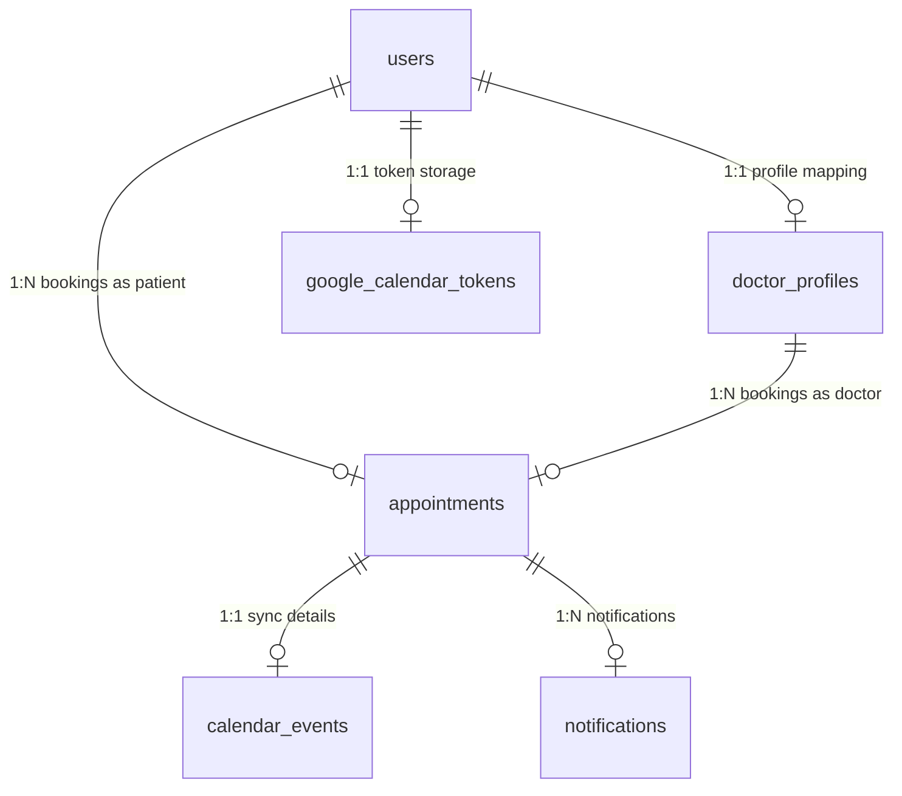

# Database Schema

The relational schema is configured dynamically using Flyway (or automatic Hibernate schema validation during bootstrapping) and populated with necessary performance-critical indexes and constraints.

## 1. Table Definitions

### `users`
Represents patients, doctors, and system administrators.
- `id` (UUID, Primary Key)
- `name` (VARCHAR, Not Null)
- `email` (VARCHAR, Unique, Not Null)
- `password` (VARCHAR, Not Null) - bcrypt hashed password
- `role` (VARCHAR, Not Null) - Enum: `PATIENT`, `DOCTOR`, `ADMIN`
- `enabled` (BOOLEAN, Default true)
- `created_at` (TIMESTAMP)
- `updated_at` (TIMESTAMP)

### `doctor_profiles`
Details specific credentials and settings for doctors.
- `id` (BIGINT, Primary Key, Identity)
- `user_id` (UUID, Foreign Key -> `users(id)`, Unique)
- `specialization` (VARCHAR)
- `qualification` (VARCHAR)
- `experience` (INT)
- `consultation_duration` (INT, Default 30) - minutes per appointment slot
- `working_schedule` (VARCHAR, Length 2048) - JSON/Text schedule configurations
- `active_status` (BOOLEAN, Default true)

### `appointments`
Details held, confirmed, completed, or cancelled slots.
- `id` (BIGINT, Primary Key, Identity)
- `patient_id` (UUID, Foreign Key -> `users(id)`)
- `doctor_profile_id` (BIGINT, Foreign Key -> `doctor_profiles(id)`)
- `appointment_date` (DATE)
- `start_time` (TIME)
- `end_time` (TIME)
- `status` (VARCHAR, Length 20) - Enum: `HELD`, `CONFIRMED`, `CANCELLED`, `COMPLETED`, `NO_SHOW`
- `symptoms` (TEXT)
- `ai_summary` (TEXT) - Urgency Chief Complaint summary
- `urgency_level` (VARCHAR, Length 20) - Enum: `LOW`, `MEDIUM`, `HIGH`
- `ai_suggested_questions` (TEXT) - Suggested questions for the doctor
- `clinical_notes` (TEXT) - Doctors private notes
- `prescription` (TEXT)
- `post_visit_ai_summary` (TEXT) - Patient-friendly AI post-visit notes
- `created_at` (TIMESTAMP)
- `updated_at` (TIMESTAMP)

### `medication_schedules`
Stores schedules parsed from post-visit notes for daily reminders.
- `id` (BIGINT, Primary Key, Identity)
- `patient_id` (UUID, Foreign Key -> `users(id)`)
- `appointment_id` (BIGINT, Foreign Key -> `appointments(id)`)
- `medication_name` (VARCHAR, Not Null)
- `dosage` (VARCHAR)
- `frequency` (VARCHAR) - Enum: `ONCE_DAILY`, `TWICE_DAILY`, `THREE_TIMES_DAILY`, `FOUR_TIMES_DAILY`, `AS_NEEDED`
- `start_date` (DATE)
- `end_date` (DATE)
- `created_at` (TIMESTAMP)

### `notifications`
Mail log tracking status, retries, and errors.
- `id` (BIGINT, Primary Key, Identity)
- `recipient` (VARCHAR, Not Null)
- `type` (VARCHAR, Not Null) - Enum: `APPOINTMENT_CONFIRMATION`, `APPOINTMENT_CANCELLATION`, `APPOINTMENT_REMINDER`, `MEDICATION_REMINDER`
- `subject` (VARCHAR, Not Null)
- `body` (TEXT, Not Null)
- `status` (VARCHAR, Not Null) - Enum: `PENDING`, `SENT`, `FAILED`
- `retry_count` (INT, Default 0)
- `last_attempt_at` (TIMESTAMP)
- `sent_at` (TIMESTAMP)
- `error_message` (TEXT)
- `related_appointment_id` (BIGINT, Foreign Key -> `appointments(id)`)
- `created_at` (TIMESTAMP)

### `google_calendar_tokens`
Encapsulates Google OAuth credentials safely inside the database boundary.
- `id` (BIGINT, Primary Key, Identity)
- `user_id` (UUID, Foreign Key -> `users(id)`, Unique)
- `access_token` (VARCHAR(2048), Not Null)
- `refresh_token` (VARCHAR(2048))
- `expires_in_seconds` (BIGINT, Not Null)
- `issued_at` (TIMESTAMP, Not Null)
- `created_at` (TIMESTAMP)
- `updated_at` (TIMESTAMP)

### `calendar_events`
Keeps track of synchronized events across patients and doctors.
- `id` (BIGINT, Primary Key, Identity)
- `appointment_id` (BIGINT, Foreign Key -> `appointments(id)`, Unique)
- `patient_event_id` (VARCHAR)
- `doctor_event_id` (VARCHAR)
- `status` (VARCHAR) - `PENDING`, `SYNCED`, `FAILED`, `CANCELLED`
- `last_error` (TEXT)
- `created_at` (TIMESTAMP)
- `updated_at` (TIMESTAMP)

## 2. Integrity Constraints & Indexes

- **Double Booking Prevention**:
  `CREATE UNIQUE INDEX idx_unique_active_appointment ON appointments (doctor_profile_id, appointment_date, start_time) WHERE status IN ('HELD', 'CONFIRMED', 'COMPLETED', 'NO_SHOW');`
  *(Ensures the same slot cannot be booked or held twice concurrently)*.

- **Performance-Critical Indexes**:
  - `idx_appointments_doctor_id` on `appointments(doctor_profile_id)`
  - `idx_appointments_patient_id` on `appointments(patient_id)`
  - `idx_appointments_date` on `appointments(appointment_date)`
  - `idx_appointments_status` on `appointments(status)`
  - `idx_notifications_status` on `notifications(status)`
  - `idx_notifications_recipient` on `notifications(recipient)`
